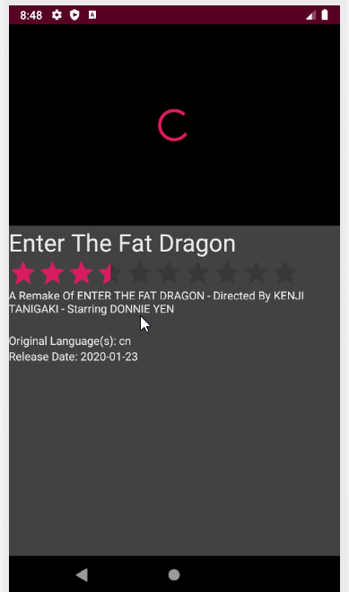

# Flixter
Flixter is an app that allows users to browse movies from the [The Movie Database API](http://docs.themoviedb.apiary.io/#).
### Features

- [x] (8pts) Expose details of movie (ratings using RatingBar, popularity, and synopsis) in a separate activity.
- [x] (2pts) Allow video posts to be played in full-screen using the YouTubePlayerView.
- [x] Trailers for popular movies are played automatically when the movie is selected (1 point).
  - [x] When clicking on a popular movie (i.e. a movie voted for more than 5 stars) the video should be played immediately.
  - [x] Less popular videos rely on the detailed page should show an image preview that can initiate playing a YouTube video.
- [x] Add a play icon overlay to popular movies to indicate that the movie can be played (1 point).

### App Walkthough GIF

 

## Open-source libraries used
- [Android Async HTTP](https://github.com/codepath/CPAsyncHttpClient) - Simple asynchronous HTTP requests with JSON parsing
- [Glide](https://github.com/bumptech/glide) - Image loading and caching library for Android
---
